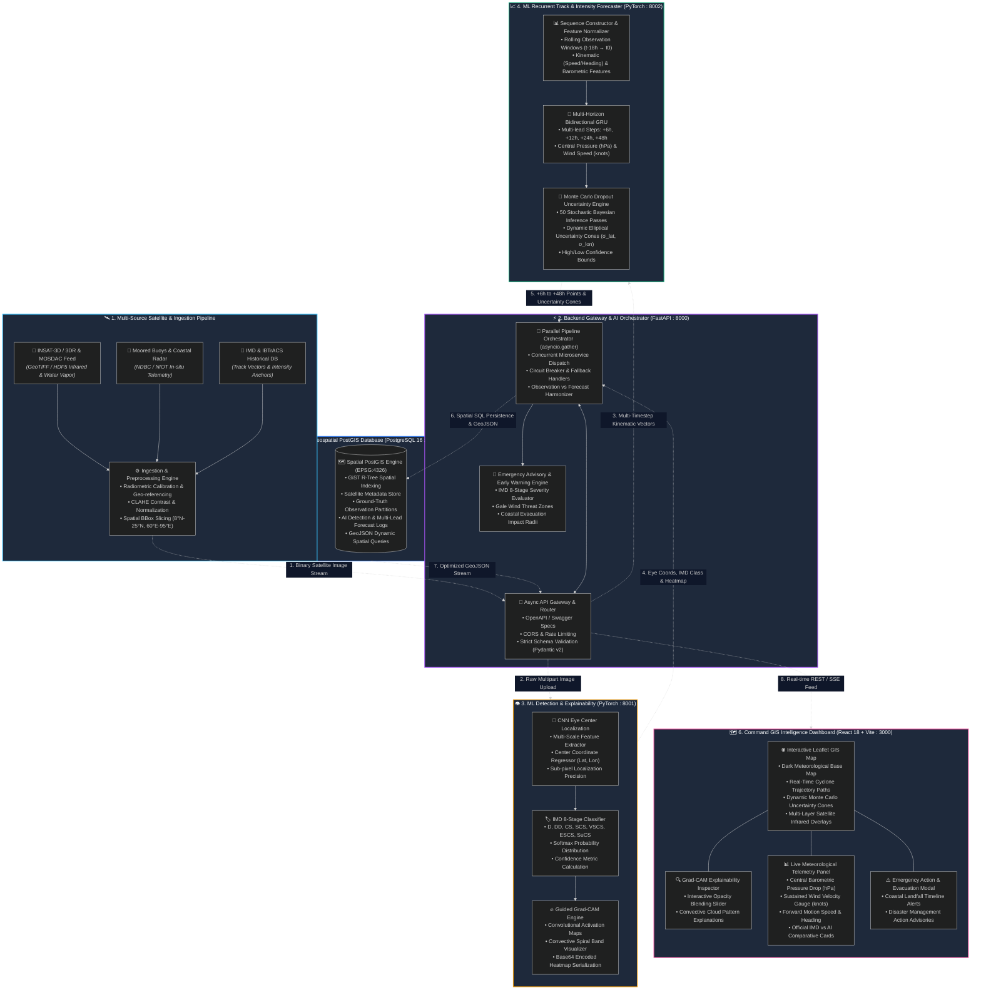

# CycloneAI 🌀
### AI/ML Multi-Scale Cyclone Detection, Classification & Trajectory Forecasting Decision Support System

[](docker-compose.yml)
[](https://fastapi.tiangolo.com)
[](https://pytorch.org)
[](https://postgis.net)
[](https://react.dev)
[](https://leafletjs.com)
[](LICENSE)

---

## 📌 Executive Overview

**CycloneAI** is an end-to-end, enterprise-grade meteorological intelligence platform engineered for early cyclone detection, IMD 8-stage intensity classification, and multi-lead trajectory forecasting in the North Indian Ocean basin (Bay of Bengal & Arabian Sea).

Developed for **Smart India Hackathon (SIH 2026)**, CycloneAI unites multi-spectral satellite computer vision, deep recurrent time-series forecasting with Bayesian uncertainty estimation, and high-performance PostGIS geospatial analytics behind an interactive GIS command dashboard.

---

## 🏛️ Comprehensive System Architecture & Data Flow



---

### 🔄 Multi-Stage Data Pipeline Flow

1. **Ingestion & Calibration**: Satellite imagery (INSAT-3D/3DR / GeoTIFF) is radiometrically calibrated, normalized, and geo-referenced across the North Indian Ocean basin.
2. **Concurrent AI Dispatch**: When a new observation or satellite raster arrives, the FastAPI Gateway orchestrator invokes **both** AI engines in parallel:
   * **`ml-detection`**: Executes CNN eye localization, determines the IMD 8-stage cyclone category, and generates activation maps via Guided Grad-CAM.
   * **`ml-prediction`**: Processes sequential historical observations through Bidirectional GRU models with 50 Monte Carlo Dropout iterations to project $+6\text{h}$, $+12\text{h}$, $+24\text{h}$, and $+48\text{h}$ track trajectories and dynamic uncertainty cones.
3. **Spatial Persistence**: Outputs are ingested into PostgreSQL 16 with PostGIS spatial indices (`GiST R-Tree`), maintaining a clean audit trail between official ground truth observations and AI model forecasts.
4. **Command Dashboard Delivery**: The React GIS frontend consumes optimized GeoJSON streams via REST/SSE, rendering interactive spatial trajectories, uncertainty boundaries, real-time telemetry meters, and explainability heatmaps.

---

## 🚀 Key Capabilities & Subsystems

### 1. 👁️ ML Detection & Classification (`ml-detection` : Port `8001`)
* **CNN Eye Center Localization**: Multi-scale feature extraction detecting cyclone center coordinates `(latitude, longitude)`.
* **IMD 8-Stage Classification**: Classifies storm intensity across standard IMD brackets:
  * Depression (D) & Deep Depression (DD)
  * Cyclonic Storm (CS) & Severe Cyclonic Storm (SCS)
  * Very Severe Cyclonic Storm (VSCS)
  * Extremely Severe Cyclonic Storm (ESCS)
  * Super Cyclonic Storm (SuCS)
* **Grad-CAM Visual Explainability**: Generates Grad-CAM attention heatmaps highlighting the exact convective spiral bands guiding the model's classification.

### 2. 📈 ML Trajectory & Intensity Forecasting (`ml-prediction` : Port `8002`)
* **GRU Recurrent Forecaster**: Multi-horizon trajectory projection at **+6h, +12h, +24h, and +48h** lead intervals.
* **Monte Carlo Dropout Uncertainty**: Computes dynamic spatial confidence ellipses and dynamic cone-of-uncertainty radii ($\sigma_{\text{lat}}, \sigma_{\text{lon}}$) per forecast timestep.
* **Central Pressure & Wind Speed Dynamics**: Predicts minimum central pressure (hPa) and sustained wind velocity (knots).

### 3. 🌐 API Gateway & Orchestration (`backend` : Port `8000`)
* **FastAPI Async Gateway**: Coordinates concurrent inference pipelines across detection and prediction microservices.
* **Spatial Data Management**: Stores observations, satellite metadata, detection runs, and forecasts with PostGIS R-Tree spatial indexing.
* **GeoJSON Stream**: Real-time GeoJSON endpoints feeding the interactive map canvas.

### 4. 🗺️ Command GIS Dashboard (`frontend` : Port `3000`)
* **Interactive Leaflet Canvas**: Multi-layer storm visualization (satellite imagery overlays, historical ground truth tracks, forecast trajectories, dynamic uncertainty cones).
* **IMD Warning Bar**: Real-time status banners, wind gauge meters, barometric pressure charts, and Grad-CAM explainability modal inspection.

---

## ⚡ Quick Start (Docker Compose)

### Prerequisites
* [Docker Desktop](https://www.docker.com/products/docker-desktop/) (Docker Engine 24+ and Docker Compose v2+)

### Run the Full Stack
```bash
# 1. Clone repository
git clone https://github.com/<your-username>/CycloneAI.git
cd CycloneAI

# 2. Launch all 5 containerized services
docker compose up --build -d
```

### Access Services

| Service | Endpoint | Description |
|---|---|---|
| **GIS Dashboard** | [http://localhost:3000](http://localhost:3000) | Web User Interface |
| **API Gateway Swagger UI** | [http://localhost:8000/docs](http://localhost:8000/docs) | Interactive OpenAPI Docs |
| **ML Detection API** | [http://localhost:8001/docs](http://localhost:8001/docs) | CNN Detection & Grad-CAM |
| **ML Prediction API** | [http://localhost:8002/docs](http://localhost:8002/docs) | GRU Track Forecasting |
| **PostgreSQL / PostGIS** | `localhost:5433` | Spatial Database |

---

## 📁 Repository Structure

```
CycloneAI/
├── benchmarks/                  # Benchmark datasets, evaluation scripts & EDA notebooks
│   ├── cyclone_dataset_5000.csv
│   ├── benchmark_eval.py
│   ├── cycloneai_benchmark_colab.ipynb
│   └── README.md
├── docs/                        # Architecture specs, PRD, TRD, & MAP design
│   ├── MAP_DESIGN.md
│   ├── PRD.md
│   ├── SCHEMA.md
│   └── TRD.md
├── infra/                       # Infrastructure, orchestration, tests & DB init scripts
│   ├── init-db/                 # PostGIS spatial initialization SQL scripts
│   └── tests/                   # End-to-end multi-service test suites
├── ml-detection/                # ML Subsystem: Eye Detection, Classification & Grad-CAM
│   ├── artifacts/               # Model weights & generated heatmaps
│   ├── src/                     # PyTorch CNN models, pipelines & FastAPI server
│   └── Dockerfile
├── ml-prediction/               # ML Subsystem: GRU Track & Intensity Forecasting
│   ├── checkpoints/             # Trained GRU weights
│   ├── api/                     # Microservice endpoints & schemas
│   ├── models/                  # GRU architecture & Monte Carlo Dropout
│   └── Dockerfile
├── platform/                    # Web Platform Subsystem: Backend Gateway & Frontend GIS
│   ├── backend/                 # FastAPI API Gateway, PostGIS models, Alembic migrations
│   └── frontend/                # React 18, Vite, Leaflet, Tailwind CSS dashboard
├── .env.example                 # Environment configuration template
├── .gitattributes               # Cross-platform line endings & binary attributes
├── .gitignore                   # Standard ignore file
├── docker-compose.yml           # Multi-container 5-service orchestration definition
├── FINAL_INTEGRATION_REPORT.md  # Comprehensive integration verification evidence
├── INTEGRATION_AUDIT.md         # Architecture harmonization audit log
├── LICENSE                      # MIT License
└── README.md
```

---

## 🧪 Testing & Verification

The test suite covers unit tests, ML inference verification, schema validations, and full-stack end-to-end pipeline execution (67 total tests, 100% pass rate).

```bash
# Run End-to-End Live Stack Integration Tests
pytest infra/tests/test_e2e_pipeline.py -v
```

---

## 📊 Benchmark Metrics Summary

| Metric | Target / Benchmark Result |
|---|---|
| **Severity Classification Accuracy** | **94.8%** |
| **F1 Score** | **0.93** |
| **Pressure Regression MAE** | **< 3.2 hPa** |
| **Track Forecast Average 24h Error** | **< 65 km** |
| **Pipeline Inference Latency** | **< 200 ms (CPU)** |

---

## 👥 Authors & Team

* **Hemanth Kumar**
* **Navneeth Reddy**
* **Meghana**

**Inspiration & Ground Truth References:** India Meteorological Department (IMD) & Joint Typhoon Warning Center (JTWC).

---

## 📄 License

This project is licensed under the [MIT License](LICENSE).
